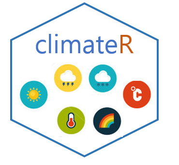
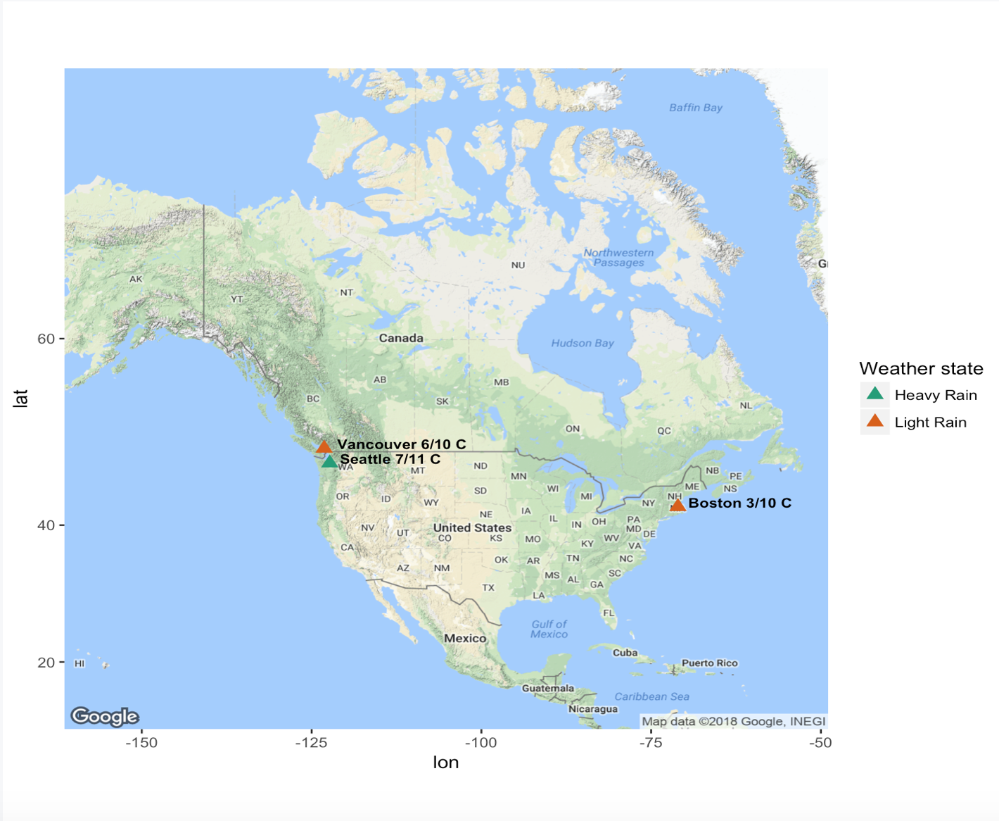
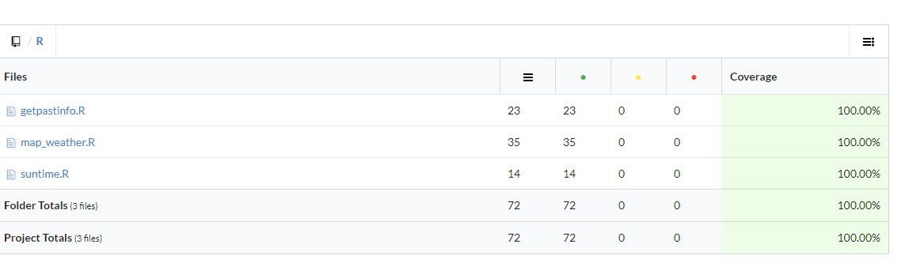

# climateR :cloud: :sunny: :snowflake:
R wrapper for [MetaWeather API](https://www.metaweather.com/api/)

[](https://travis-ci.org/UBC-MDS/climateR)
[](https://codecov.io/gh/UBC-MDS/climateR)



## Contributors

- `Akshi Chaudhary`: [akshi8](https://github.com/akshi8)
- `Cem Sinan Ozturk`: [cemsinano](https://github.com/cemsinano)
- `Nazli Ozum Kafaee`: [nazliozum](https://github.com/nazliozum)
- `Tarini Bhatnagar`: [tarinib](https://github.com/tarinib)

## Latest
* Date : April 14, 2018
* Release: v1.0

## About

climateR is a R API wrapper which offers offers 3 functions that enable the user to call for data from the [MetaWeather API](https://www.metaweather.com/api/):

- `get_weather(cities, continent)`: Maps the weather state of given cities (all from same continent) on the current date.

- `sunrise(city)`: Gets sunrise and sunset time as well as the total day time of a particular city on the current date.

- `getpastinfo(city_name, date)`: Gets minimum temperature, maximum temperatures, average wind speed, and average humidity of a particular city on a given date.


## Installation

You can install climateR from Github with:

```
# install.packages("devtools")
devtools::install_github("UBC-MDS/climateR")

```

## Usage Examples

* __get_weather(cities, continent)__

```
# Plot weather state of Vancouver and Seattle on map

get_weather(cities = c("Vancouver", "Seattle", "Boston"), continent = "North America")
```


* __suntime()__

```
# Get sunrise, sunset, and total day time for Instanbul today

suntime("Istanbul")

Output:
$sunrise
[1] "03:26:53"

$sunset
[1] "16:42:34"

$day_time
[1] "13 hours and 16 minutes"

```

* __getpastinfo()__

```
# Get value for Vancouver on 2017/8/30

getpastinfo("Vancouver", "2017/8/30")

Output:
$min_temp
[1] 16.10833

$max_temp
[1] 21.51667

$windspeed
[1] 4.64

$humidity
[1] 67.32
```

## Branch coverage



## License

[MIT License](LICENSE.md)

## Future Developments

The `climateR` wrapper will be improved in the future to include weather icons and cities from different parts of the world and not just from one continent.

## Contributing

This is an open source project. Please follow the guidelines below for contribution.
  - Open an issue for any feedback and suggestions.
  - For contributing to the project, please refer to [Contributing](CONTRIBUTING.md) for details.

This is an open source project. So feedback, suggestions and contributions are very welcome. For feedback and suggestions, please open an issue in this repo. If you are willing to contribute this package, please refer to [Contributing](CONTRIBUTING.md) guidelines for details.
